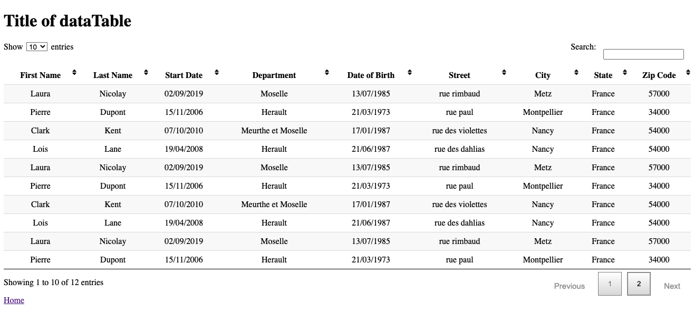

# Presentation

This project is a dataTable with the following features:

- Pagination
- Select of the number of entries that will be visible per page
- Informations about the number of entries there are displayed on page of the dataTable
- Search input for filtered entries of dataTable
- Sorting columns

Here, dataTable for employee for example of column:


My react dataTable :

## Getting Started

### Install dependencies

You can install this dataTable with npm:

```
npm install datatable_react_nicolay
```

## For beginning

### Import the dataTable

```js
import { DataTable } from "datatable_react_nicolay";
```

### Put dataTable in your project with props

Add dataTable component to your project

```js
<DataTable
  data={[{ firstName: "Laura", lastName: "Nicolay" }]}
  columns={columns}
/>
```

| Props   | Type   |                                                      Description |
| ------- | ------ | ---------------------------------------------------------------: |
| data    | object |   data of dataTable: it can be react context, redux or an array. |
| columns | array  | for each column, put label, id and type (string, date or number) |

#### Data of your dataTable

When you implement your DataTable component, you need to pass it the datas.
It can be react context, redux or an array.

```js
<DataTable data={yourDatas} columns={columns} />
```

#### Columns of your dataTable

You must import file of columns, which is in src/lib/columns/columns.js

```js
import { columns } from "datatable_react_nicolay";
```

Currently this dataTable is an example for employee dataTable with as column firstname, lastname, adress, date of birth and date of start.

You have to change the columns and write whatever columns you want.
For that, open src/lib/columns/columns.js et change label, id and type (string, date or number) of your columns.
For a dataTable of cars, for example, you would write:

```js
// Write here label and id for columns
export const columns = [
  { label: "Car Brand ", id: "Brand", type: "string" },
  { label: "Car Model", id: "Model", type: "string" },
  { label: "car Date", id: "Date", type: "date" },
  { label: "Number of place", id: "numberOfPlace", type: "number" },
  { label: "Car registration", id: "registration", type: "string" },
];
```

## Tests

If you want take tests of your dataTable, you can run tests with :

```
npm test

```

Else, if you don't want take tests, the folder _tests_ will be of no use to you
